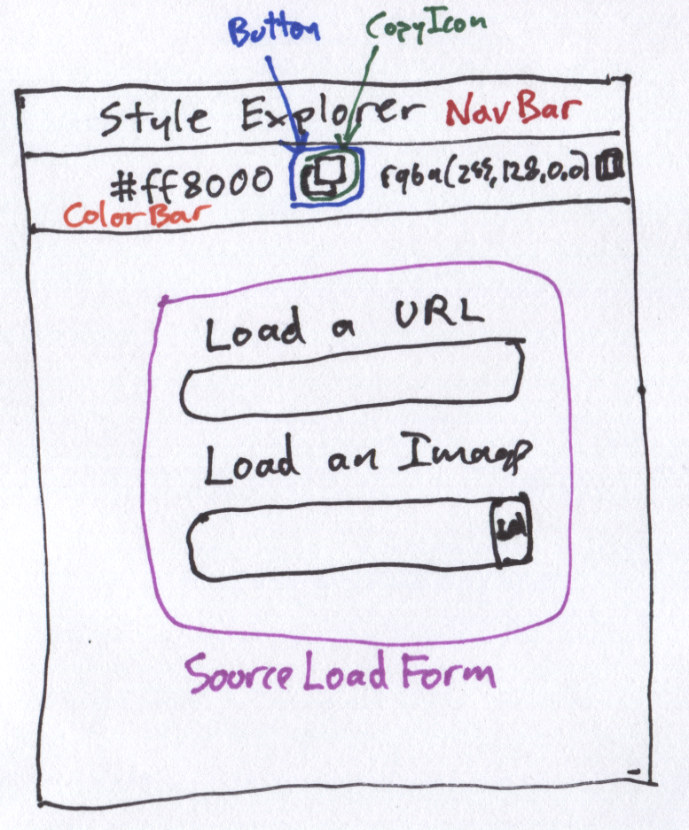
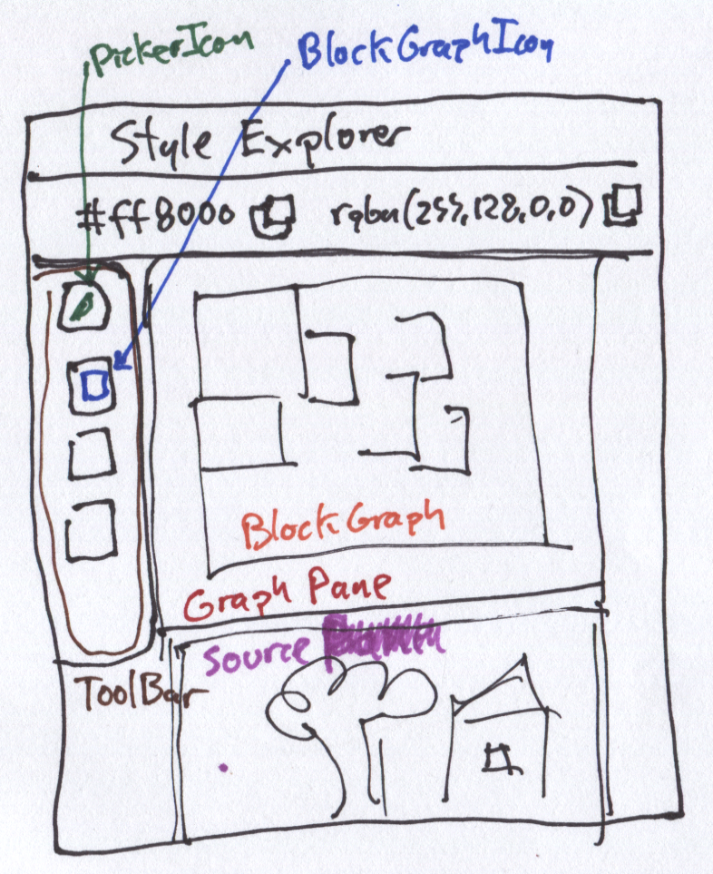
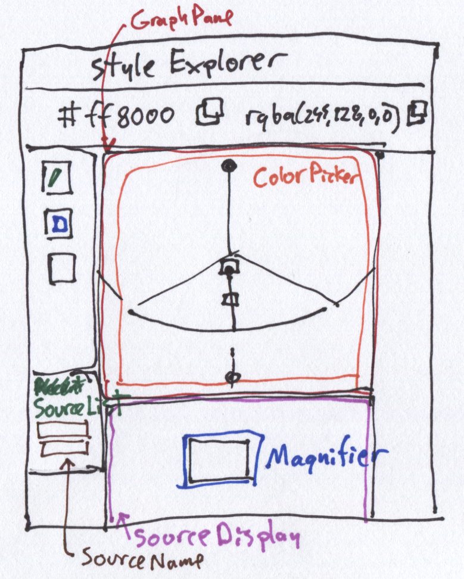

# Style Explorer Components

## Component Tree

App
- SourceContainer [Main application state]

### Initial Component Tree Sketch

## Application Sketches

I created these sketches of the various dynamic states of the app in order to sort out the component hierarchy

### Startup Mode

### Graph Mode

### Picker Mode

