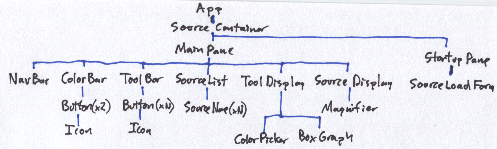

# Style Explorer Components

## Component Tree

- App
  - NavBar
  - MainPane
    - Collapsible
      - CollapseButton
      - ColorBar
        - Button (x2)
          - CopyIcon
    - Collapsible
      - CollapseButton
      - ColorPicker
    - Collapsible
      - CollapseButton
      - Graph
        - BoxGraph
      - GraphTypeList
        - GraphType
    - Collapsible
      - CollapseButton
      - Source
        - Magnifier
    - Collapsible
      - CollapseButton
      - SourceLoadForm
        - Button (Load)
      - SourceList
        - SourceItem (xN)

### Initial Component Tree Sketch

## Application Sketches

I created these sketches of the various dynamic states of the app in order to sort out the component hierarchy

### Startup Mode

### Graph Mode

### Picker Mode

